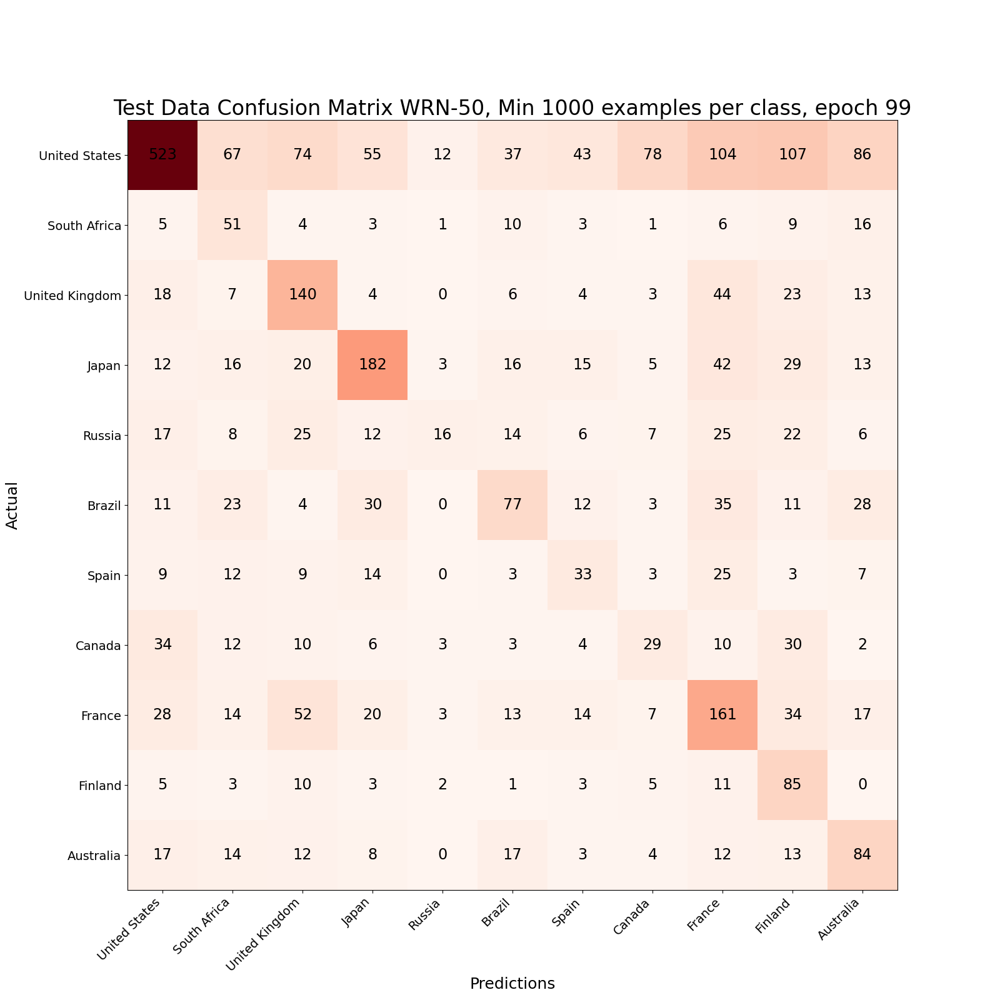
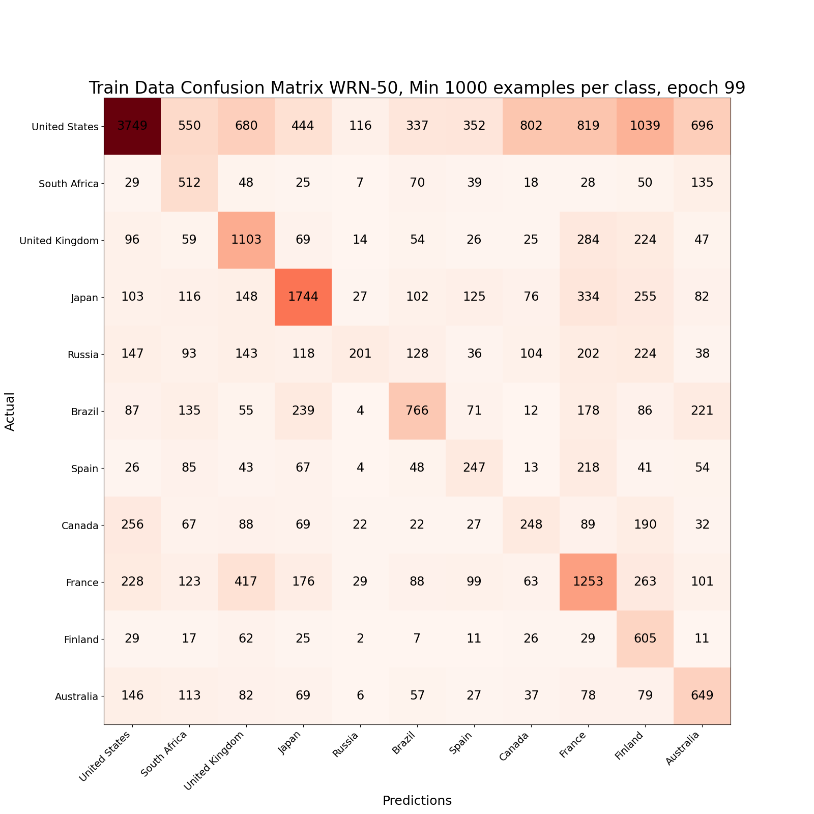

# GeoGuessrAI

## Description 
This project is a work in progress inspired by the game [GeoGuessr](https://www.geoguessr.com/). The [dataset being used](https://www.kaggle.com/datasets/ubitquitin/geolocation-geoguessr-images-50k) comes from kaggle and consists of 
~50k screenshots of the game categorized by country. It's a highly unbalanced dataset so the models in this repository are trained on a subset of the classes
that contain >= 1000 images.  

## Installation 
You'll need a working installation of [python](https://www.python.org/downloads/) and a package manager, I used [pip](https://pip.pypa.io/en/stable/installation/) but I'm sure conda could work as well. 
Also downloading the data requires a [kaggle account](https://www.kaggle.com/). Requirements for the code are in the file 'requirements.txt' and can be installed using pip with the command 

`
pip install -r requirements.txt
`

The program expects the dataset to be contained in a directory called "Data" in the same directory as main.py. 

## Usage
Currently main supports three operations, training from scratch, resuming training, and testing a trained model.

To train from scratch run 

`
python main.py train checkpoint_path_base min_examples_per_class
`

Where checkpoint_path_base is a string which is used when saving model checkpoints. Currently a checkpoint is saved for every epoch at location `checkpoint_path_base` + epoch + .pt. And min_examples_per_class is an integer specifying the minimum number of examples per class. I've only tried with 1000 as the minimum which leaves 11 classes. 

To resume training

`
python main.py resume-training checkpoint_path_base min_examples_per_class load_path
`

Where load_path is the path to the checkpoint being resumed from.

The last mode is test and is used as

`
python main.py test checkpoint_path min_examples_per_class
`

Here checkpoint_path is the full path to the checkpoint you want to test. Note that the checkpoint needs both the model parameters and a random seed in order to recreate
the train, validate, test split used in training. This will output the overall accuracy and classwise accuracy for the model on both train and test data and save the respective
confusion matrices as .png images in the same directory as main. 

## Misc Details 
For now the restricted dataset I've used consists of 11 countries. The countries and the number of samples from each country are listed below.
<ol>
    <li> United States, 12014
    <li> Japan, 3840
    <li> France, 3573
    <li> United Kingdom, 2484
    <li> Brazil, 2320
    <li> Russia, 1761
    <li> Australia, 1704
    <li> Canada, 1382
    <li> South Africa, 1183
    <li> Spain, 1075
    <li> Finland, 1049
</ol>

To deal with the imbalance weighted cross entropy loss is used based on the [implementation in sklearn](https://scikit-learn.org/stable/modules/generated/sklearn.utils.class_weight.compute_class_weight.html). The model used is a pretrained wideresnet-50 downloaded from [pytorch](https://pytorch.org/vision/master/models.html). The final fully 
connected layer is replaced in order to do classification with 11 classes and only the final layer is trained. Currently 80% of the data is used for training, 10% for validation, and 10% for testing. 

## Results
Overall accuracy, accuracy per class, and confusion matrices are reported for both the training and testing data.

### Testing Data

| Class  | Accuracy |
---------|----------|
United States | 42.65% |
Japan | 51.558% |
France | 44.353%
United Kingdom | 53.435%
Brazil | 32.906%
Russia | 10.127%
Australia | 45.6522%
Canada | 20.28%
South Africa | 46.789%
Spain | 27.966%
Finland | 66.406%
Overall | 42.65%

### Training Data

| Class  | Accuracy |
---------|----------|
United States | 39.117% |
Japan | 56.041% |
France | 44.12%
United Kingdom | 55.122%
Brazil | 41.316%
Russia | 14.017%
Australia | 48.325%
Canada | 22.342%
South Africa | 53.278%
Spain | 29.196%
Finland | 73.422%
Overall | 42.753%

## Observations
The model outperforms a constant classifier by about 5% in overall accuracy but clearly does much better than a constant classifier for all non US classes. 
The countries with fewer data generally had a larger gap between accuracy on the training data and testing data suggesting some overfitting. The model checkpoint reported on was chosen based
off of overall validation accuracy, not performance on individual classes. A more principled choice might lead to better generalization.

## Future Directions
### Near Term
<ul>
    <li> Choose final model checkpoint more carefully to improve generalization
    <li> Test effect of changing minimum number of examples per class </li>
    <li> Fine tune all layers of model, not just final fully connected one
</ul>

### Middle Term
<ul>
    <li> Try other model architectures
    <li> Use larger dataset, e.g. <a href="https://qualinet.github.io/databases/image/world_wide_scale_geotagged_image_dataset_for_automatic_image_annotation_and_reverse_geotagging/">World-Wide Scale Geotagged Image Dataset for Automatic Image Annotation and Reverse Geotagging</a></li>
    <li> Move from predicting country to more precise location
</ul>

### Long Term
<ul>
    <li> Actually play GeoGuessr?
</ul>